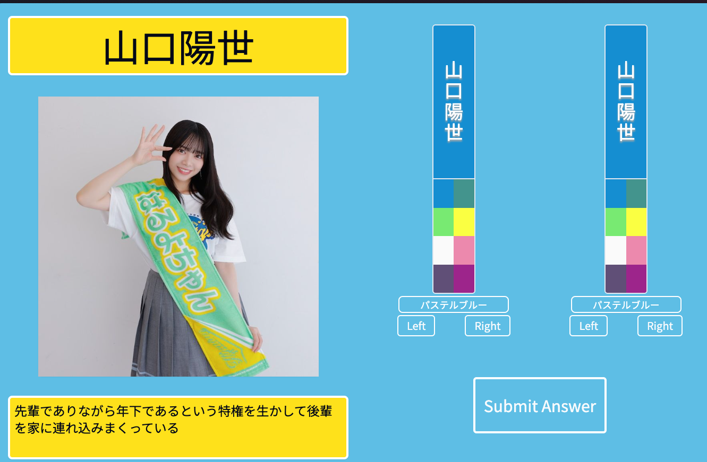

# 日向坂46ペンライトクイズ

2024年11月時点のメンバーで、日向坂46のペンライトの色の組み合わせを当てるクイズを作成しました。  



## 事前準備

- [データベースの作成手順](./docs/create-db.md)

## Quick Start

```sh
$ make init # .envファイルの作成
$ make up-dev # 開発環境の起動
$ make clean-restart-dev # 開発環境の再起動
```

## Release Deploy

```sh
$ make donw-prod
$ make clean-up-prod
```

## デプロイページ

[日向坂46ペンライトクイズ](https://hnz.shaoba.tech/)

## 参考

- [Postgres Client v17のインストール手順](https://dev.to/johndotowl/postgresql-17-installation-on-ubuntu-2404-5bfi)
